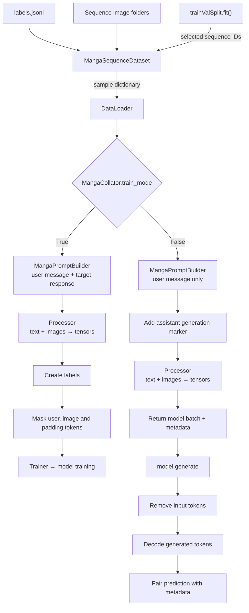

```mermaid
flowchart TD
    A["labels.jsonl"] --> C["MangaSequenceDataset"]
    B["Sequence image folders"] --> C
    S["trainValSplit.fit()"] -->|"selected sequence IDs"| C

    C -->|"sample dictionary"| D["DataLoader"]
    D --> E{"MangaCollator.train_mode"}

    E -->|"True"| T1["MangaPromptBuilder<br/>user message + target response"]
    T1 --> T2["Processor<br/>text + images → tensors"]
    T2 --> T3["Create labels"]
    T3 --> T4["Mask user, image and padding tokens"]
    T4 --> T5["Trainer → model training"]

    E -->|"False"| I1["MangaPromptBuilder<br/>user message only"]
    I1 --> I2["Add assistant generation marker"]
    I2 --> I3["Processor<br/>text + images → tensors"]
    I3 --> I4["Return model batch + metadata"]
    I4 --> I5["model.generate"]
    I5 --> I6["Remove input tokens"]
    I6 --> I7["Decode generated tokens"]
    I7 --> I8["Pair prediction with metadata"]

```