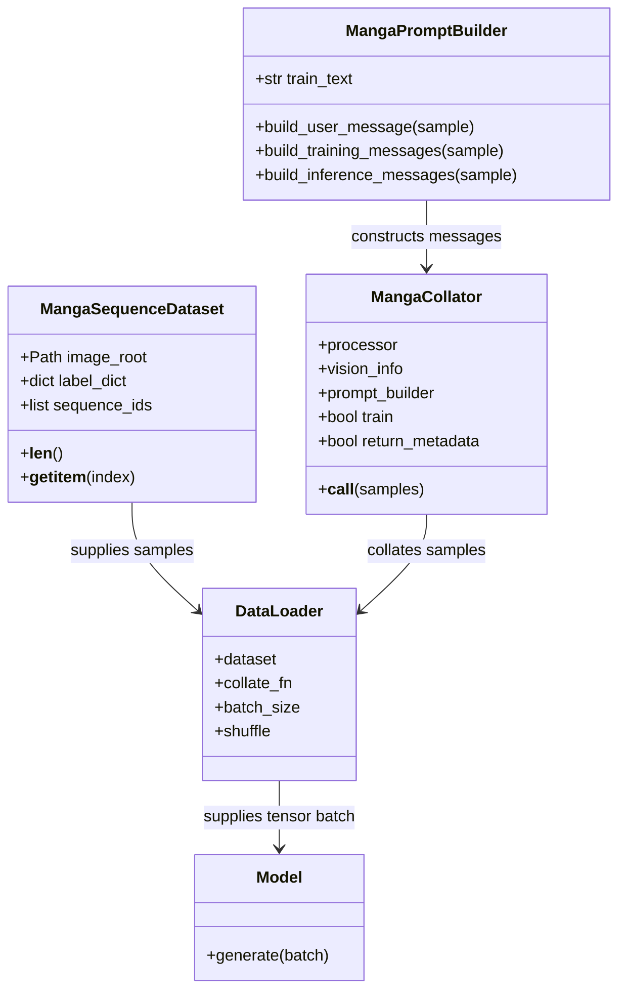

```mermaid
classDiagram
    class MangaSequenceDataset {
        +Path image_root
        +dict label_dict
        +list sequence_ids
        +__len__()
        +__getitem__(index)
    }

    class MangaPromptBuilder {
        +str train_text
        +build_user_message(sample)
        +build_training_messages(sample)
        +build_inference_messages(sample)
    }

    class MangaCollator {
        +processor
        +vision_info
        +prompt_builder
        +bool train
        +bool return_metadata
        +__call__(samples)
    }

    class DataLoader {
        +dataset
        +collate_fn
        +batch_size
        +shuffle
    }

    class Model {
        +generate(batch)
    }

    MangaSequenceDataset --> DataLoader : supplies samples
    MangaPromptBuilder --> MangaCollator : constructs messages
    MangaCollator --> DataLoader : collates samples
    DataLoader --> Model : supplies tensor batch  

  
```
